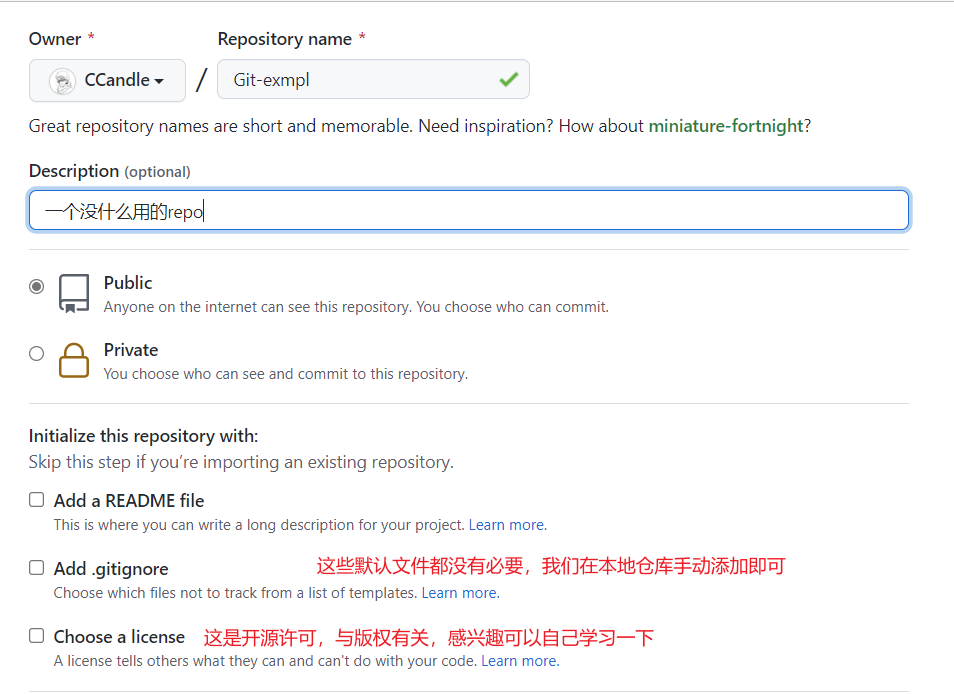
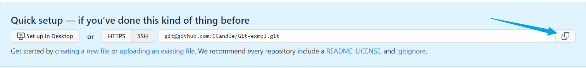

## Git示例
想来想去我得写一个Git示例。下面我就整一个Git的例子，假装这是一个正儿八经双人开发的项目，工作流程应该是怎么样的。

### 仓库初始化
首先是仓库初始化，这一部分我已经做好了，在咱们的项目中就不用管了，但是如果自己做项目的话这部分是必须的。

本地先新建工程文件夹，例如我的这个工程文件夹就叫 `Git-exmpl`。在VS Code中打开这个文件夹。
打开之后这显然是一个空的文件夹，首先我们需要先新建Git仓库。`Ctrl + J` 打开终端

```bash
git init
```

然后更改主分支名称

```bash
git branch -m master main
```

这一步会在我们的这个目录下新建一个名为 `.git` 的文件夹。默认这个文件夹是隐藏的，因此我们看不到它。

然后我们向工作区里面添加我们一个repo通常会有的东西:
`README.md` 项目的说明文档，这个项目的背景、用法、开发者、联系方式等等信息都会写在这里
`.gitignore` 这是Git的配置文件，用来告诉Git在我的项目中有哪些文件是不需要被同步的。Git在运行的时候就会自动忽略这些文件。支持正则表达式。

这时候我们就可以提交第一次**commit**了

```bash
git add .
git commit -m "git-exmpl init"
```

这时候我们本地的仓库初始化实际上已经完成了，我们把它放到github上去。

打开github，新建一个repo，名称应该与这个项目名称同名。



我们复制项目repo地址



在本地仓库连接到远程

```bash
git remote add origin git@github.com:CCandle/Git-exmpl.git
```

> origin是github远程仓库在本地的名称，一般默认都叫origin。

然后把本地main分支的内容推到github

```bash
git push origin main
```

这样，github上面就有了我们的本地仓库内容。


### 分支管理策略
通常一个完整的Git开发库一定会有main、develop这两个分支。main只用来发布重大版本，develop用来平时开发使用。

在多人协作时，通常每个人都会有自己的开发分支，在开发取得阶段性成果时，才会merge到develop分支。这能一定程度上保证develop分支不会被打乱，也不会出现冲突。

在develop到一定阶段，可以发布新的软件版本时，通常我们会从develop上新建一个`release-x.x`分支，其中x.x是软件版本。测试团队会在这个分支上进行测试，并且修改可能出现的bug。最后，测试无误后，再把这个分支merge到main与develop上。

比如说我在写完这一段之后就发布一个1.1版本。